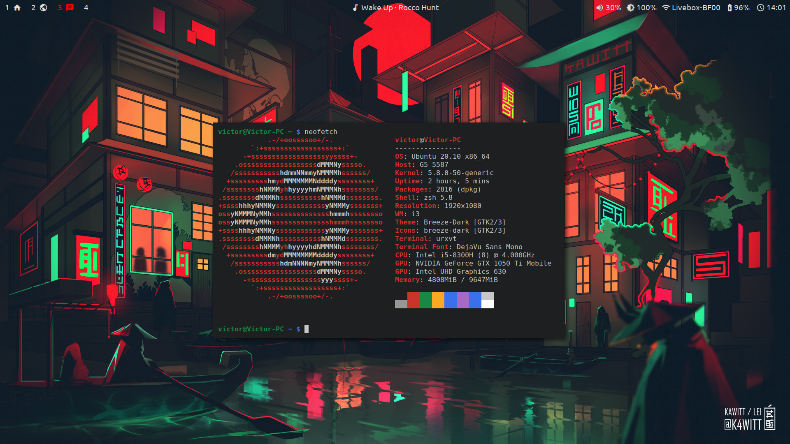

<h1 align="center">Dotfiles</h1>

    

## Dependencies list

### Main

- **i3-gaps:** the wm
- **polybar:** the status bar
- **urxvt:** the terminal
- **zsh:** the shell
- **oh-my-zsh:** the shell theme

### Utilities

- **xbacklight:** get brightness value
- **light:** control brightness (for brightness keys)
- **maim:** screenshots
- **picom:** compositor
- **pulseaudio:** get and set volume
- **playerctl:** get playing music title and music control keys

### Fonts

- **Material Icons:** status bar icons
