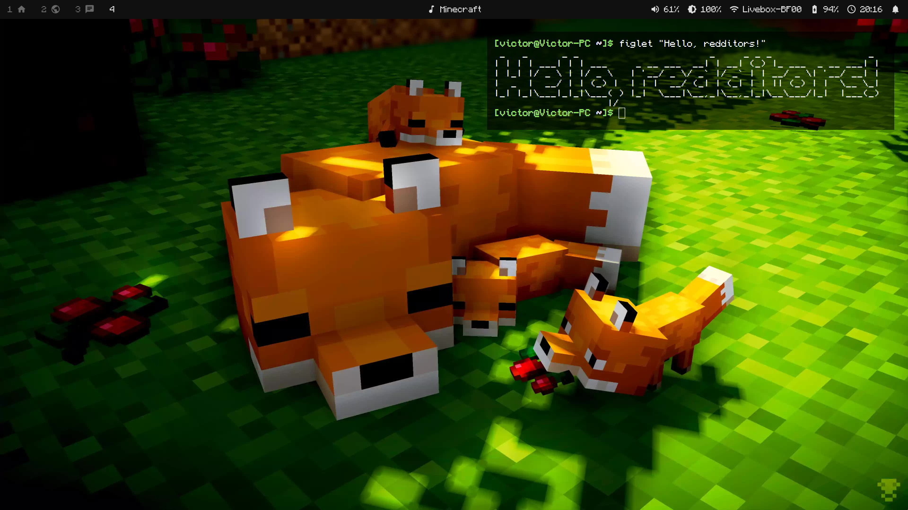

# Dotfiles

My personal dotfiles



## Installation

*Run commands in this directory*

### One-time installation (copy)

```
cp -ar dotfiles/* $HOME/
```

### Keep files in sync (symlink)

```
stow -t $HOME dotfiles
```
