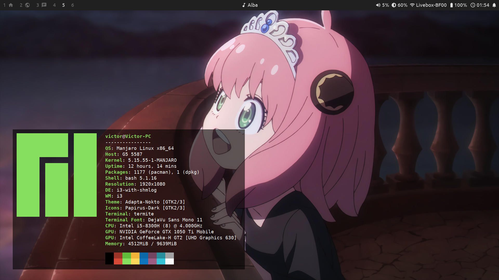

# Dotfiles

My personal dotfiles

## Installation

Install the [requirements](REQUIREMENTS.md), then

*Run commands in this directory*

- `make copy`: just copies the files
- `make symlink`: links the files so that they are kept in sync (deletion or movement of this directory will break things up, in which case you just have to run the command again)

> **Note**  
> Not only are home files copied, some also get copied to /. If you don't want them to, just press CTRL + C when asked for your password
